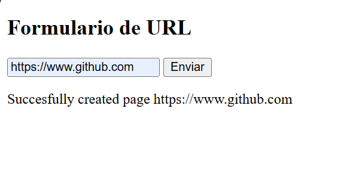
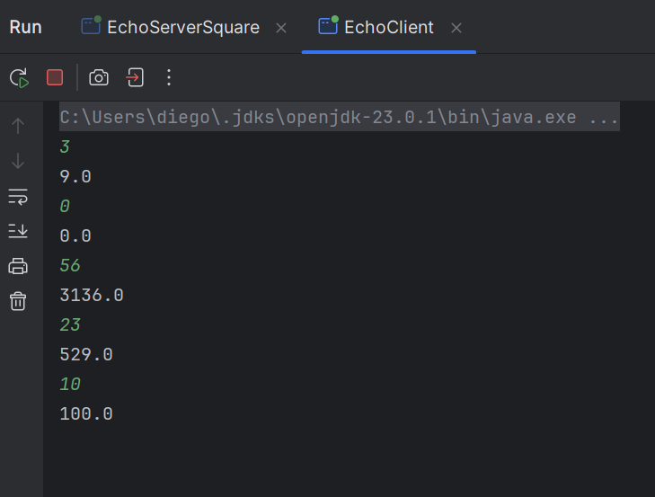
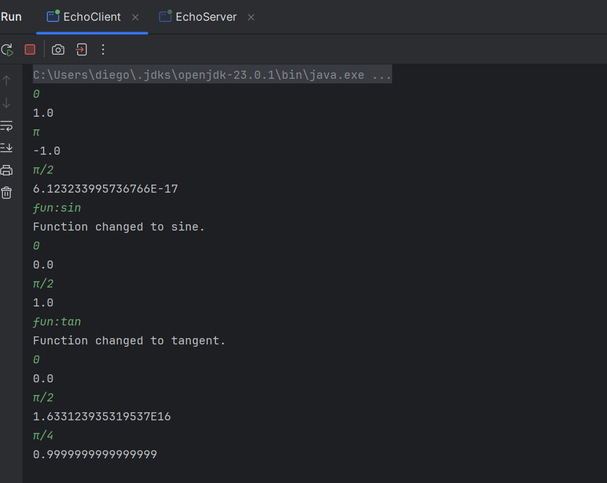
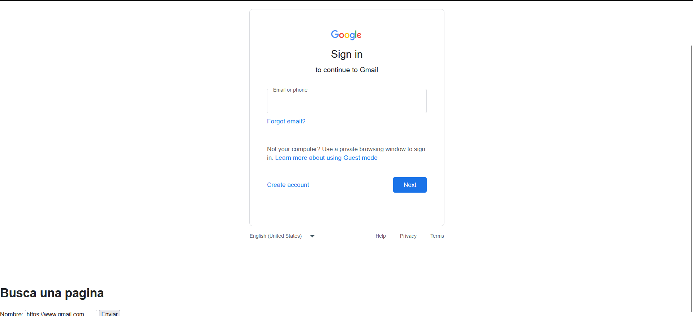
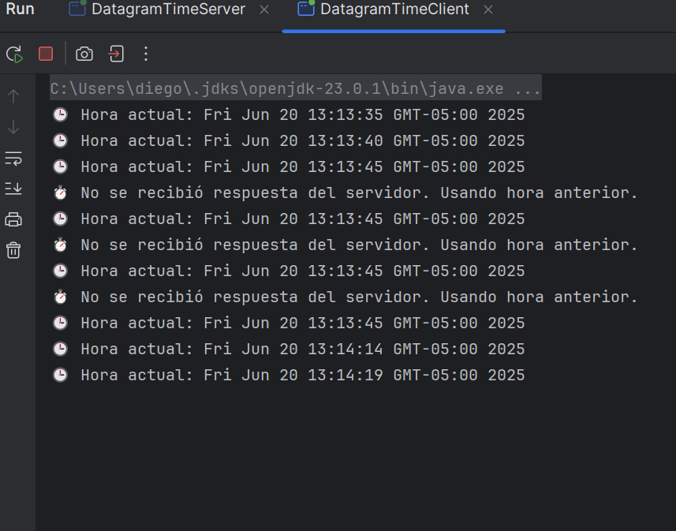
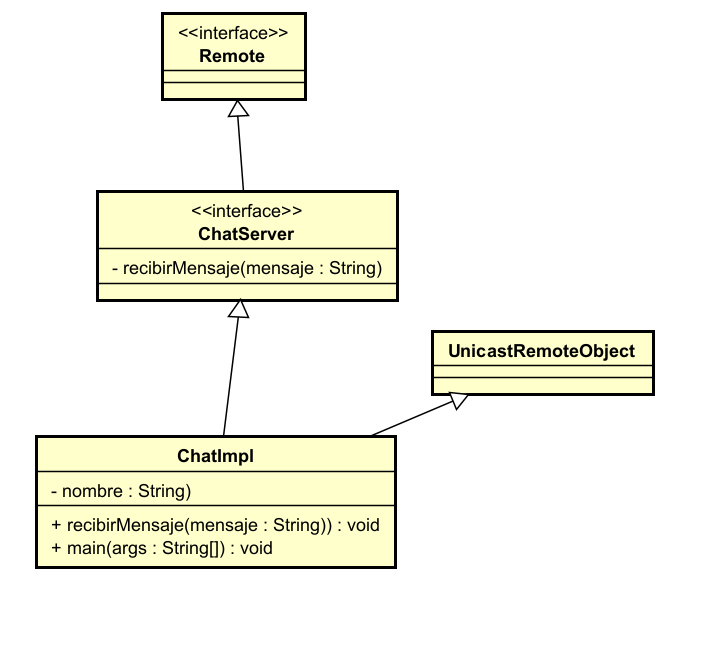
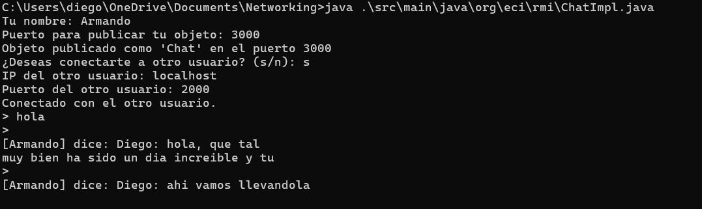
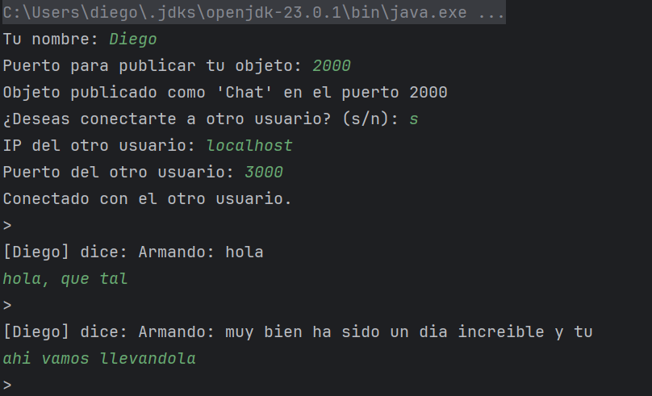

# Networking ejercicios

En este repositorio encontrarás alugnos ejercicios de aplicacion de las herramientas
de red que Java provee como URL, RMI, WebSocket, Sockets, Datagrams.
### Prerrequisitos

Necesitarás:

- [Java 17+](https://jdk.java.net/)
- [Maven 3.8+](https://maven.apache.org/install.html)
- Git (opcional para clonar)
## Ejercicio 1
Escriba un programa en el cual usted cree un objeto URL e imprima en
pantalla cada uno de los datos que retornan los 8 métodos de la sección anterior.

Url usada *https://www.escuelaing.edu.co:80/es/noticias/*
Salida:

```
Authority:www.escuelaing.edu.co:80
File: /es/noticias/
Host: www.escuelaing.edu.co
Port: 80
Path: /es/noticias/
Protocol: https
Query: null
Ref: null
```

## Ejercicio 2
Escriba una aplicación browser que pregunte una dirección URL al usuario
y que lea datos de esa dirección y que los almacene en un archivo con el nombre
resultado.html.
Luego intente ver este archivo en el navegador.

Ejemplo de uso en el navegador.

Ejecuta el archivo **Main**

Solicitamos la pagina https://www.github.com

Al abrir el archivo de resultado.html vemos:


## Ejercicio 4.3.1
Escriba un servidor que reciba un número y responda el cuadrado de este
número.

Ejemplo de ejecución.

Ejecutamos **sockets/EchoClient** y **sockets/EchoServerSquare**, lo probamos y obtenemos



## Ejercicio 4.3.2
Escriba un servidor que pueda recibir un número y responda con un operación sobre este número. Este servidor puede recibir un mensaje que empiece por
“fun:”, si recibe este mensaje cambia la operación a las especificada. El servidor
debe responder las funciones seno, coseno y tangente. Por defecto debe empezar
calculando el coseno. Por ejemplo, si el primer número que recibe es 0, debe
responder 1, si después recibe π/2 debe responder 0, si luego recibe “fun:sin”
debe cambiar la operación actual a seno, es decir a a partir de ese momento
debe calcular senos. Si enseguida recibe 0 debe responder 0.

Ejemplo de ejecución.

Ejecutamos **sockets/EchoClient** y **sockets/ex3/EchoServer**, lo probamos y obtenemos


## Ejercicio 4.5.1
Escriba un servidor web que soporte múltiples solicitudes seguidas (no con-
currentes). El servidor debe retornar todos los archivos solicitados, incluyendo
páginas html e imágenes.

Ejemplo de ejecución.

Ejecutamos **ServerSockets** y abrimos **index.html** 
Probamos con https://www.gmail.com



## Ejercicio 5.2.1
Utilizando Datagramas escriba un programa que se conecte a un servidor
que responde la hora actual en el servidor. El programa debe actualizar la hora
cada 5 segundos según los datos del servidor. Si una hora no es recibida debe
mantener la hora que tenía. Para la prueba se apagará el servidor y después de
unos segundos se reactivará. El cliente debe seguir funcionando y actualizarse
cuando el servidor este nuevamente funcionando.

Ejemplo de ejecución.

Ejecutamos **datagram/DatagramTimeServer** y **datagram/DatagramTimeClient**
Luego de 10s apagaremos el servidor para ver su funcionamiento y luego lo prenderemos de nuevo


## Ejercicio 6.4.1

CHAT: Utilizando RMI, escriba un aplicativo que pueda conectarse a otro
aplicativo del mismo tipo en un servidor remoto para comenzar un chat. El
aplicativo debe solicitar una dirección IP y un puerto antes de conectarse con el
cliente que se desea. Igualmente, debe solicitar un puerto antes de iniciar para
que publique el objeto que recibe los llamados remotos en dicho puerto.

### Diseño

Ejemplo de ejecución.

Ejecutamos compilamos las clases en rmi y ejecutamos **rmi/ChatImpl** en distintas terminales

* Usuario 1
  
* Usuario 2
  
